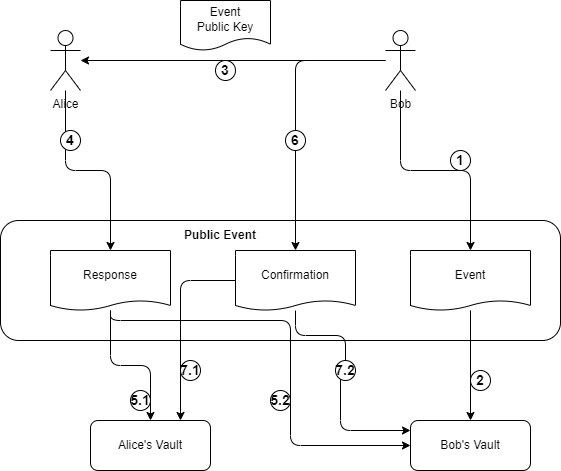

# 项目背景

本案例假设背景是记录开源社区公共活动情况。其中Bob为活动组织者，Alice为参与用户，`Public Event`为公共事件模块插件。

## 什么是公共活动？

公共活动是组织者发起的允许所有人报名参加的活动。例如一个社区的meetup，一个讲座等等，普通人报名就可以参加。活动结束后，组织者根据实际参与情况，记录参与情况。

## 活动过程

 

1. Bob创建活动，并在自己的Vault中新建一个协作区，用于存储与该活动有关信息。
2. Bob将活动信息和报名要求存入自己的`Vault`的协作区，并允许任何人读取和写入报名信息。
3. Bob公布活动信息和自己的公钥。
4. Alice在自己的`Vault`创建一个协作区，并允许Bob向其中写数据。
5. Alice按照报名要求填写报名信息，并存入自己的`Vault`，并同步写入Bob的Vault中。
6. 活动结束后。
7. Bob根据活动参与情况，记录每位参与者的确认信息，并记入自己以及参与者的Vault。

# 技术方案

## `Public Event`插件

该插件用于处理业务逻辑。它需要完成。

1. 向Bob，Alice的Vault写入或者读取数据。
2. 报名信息和确认信息，活动过程的步骤5和7，需要同步写入，向Alice和Bob的Vault中写入应满足原子性。
3. 验证报名数据的完整性。

## 活动信息

活动信息以JSON格式记录。包括：
- 活动时间
- 活动地址
- 活动内容
- 活动 DID（唯一性ID）
- 签名
- Schema (报名要求)

## 报名要求

- 用户DID
- 微信ID
- 昵称
- 电话号码
- 签名

## 确认信息

- DID
- 参与人DID
- 组织者DID

